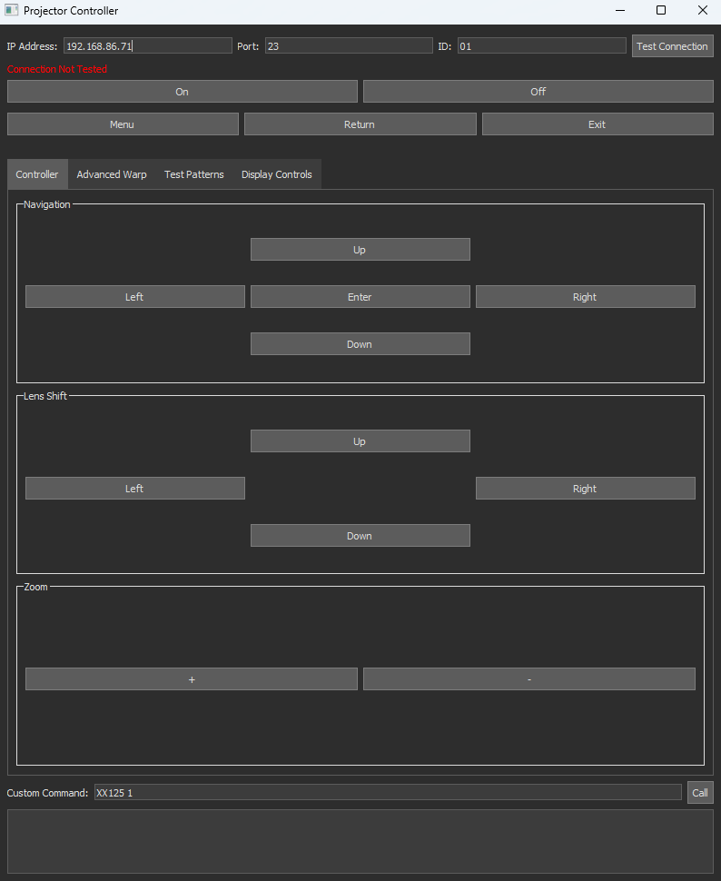
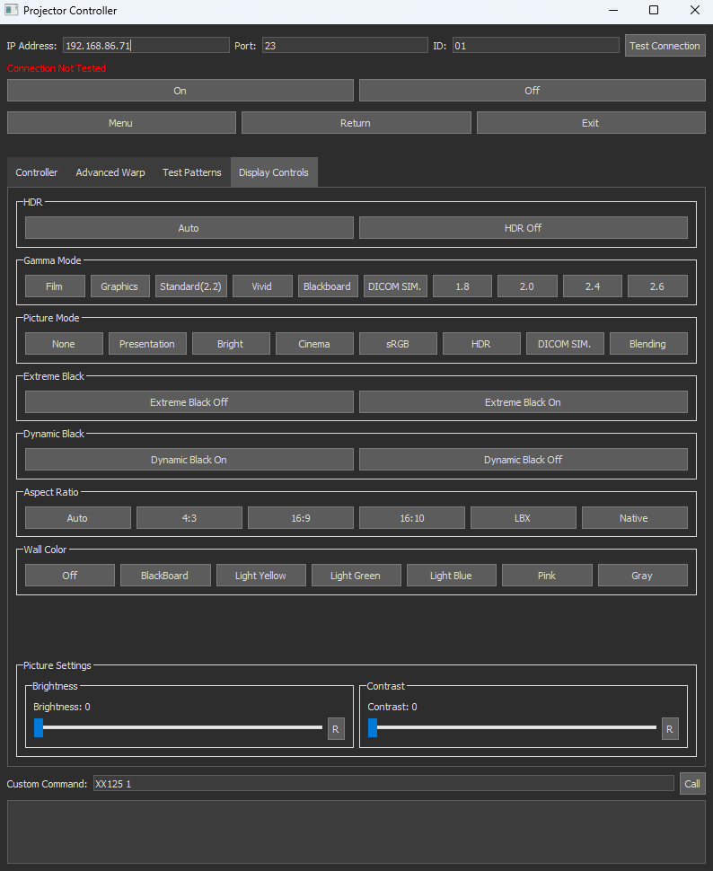
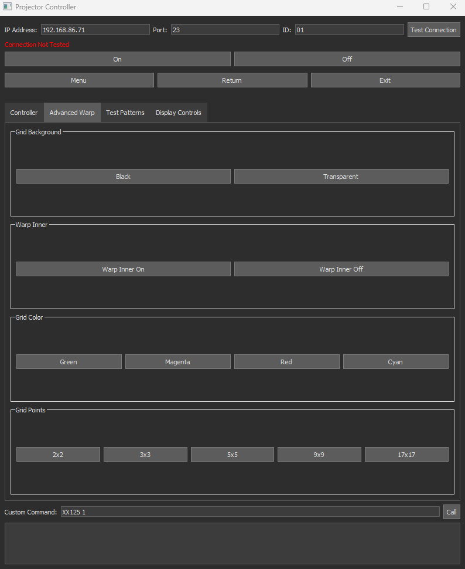

# RS232 Optoma Projector Controller
This project provides a GUI interface to control your Optoma ZU725TST projector using RS232 codes. 

| Controller                             | Display Controls                            | Advanced Warp                            |
|----------------------------------------|---------------------------------------------|------------------------------------------|
|  |  |  | 

---
## Setup
### Option 1: Create A Python Environment 

1. Navigate to folder in **Terminal**
2. Create Python Environment
   1. Call `python -m venv myenv` or `python3 -m venv myenv`
   2. Call `source myenv/bin/activate`
   3. You’ll know it’s activated when you see '**myenv**' at the beginning of your terminal prompt.
3. Install Dependencies
   1. Call `pip install -r requirements.txt`
4. Run app
   1. Call `python main.py` or `python3 main.py`

### Option 2: Install app from the releases page (Windows)
1. Download zip from [release page](https://github.com/ababilinski/rs232-telnet-optoma-controller/releases)
2. Unzip file
3. Run **Telnet Optoma Controller.exe**
---

## UI Instructions
1. First, enter your **IP**, **Port**, and **Projector ID**. You can check the connection by clicking the "**Test Connection**" button.
2. Use the UI to interact with your projector and wait for the response code.
   1. **P** means Passed
   2. **K** means failed
3. You can send custom commands using the "**Custom Command**" Input Field. Format the command to match the instruction manual (**i.e ~XX0123 1**).
4. To update the brightness and contrast slider, select the refresh button next to the slider labeled "**R**"
